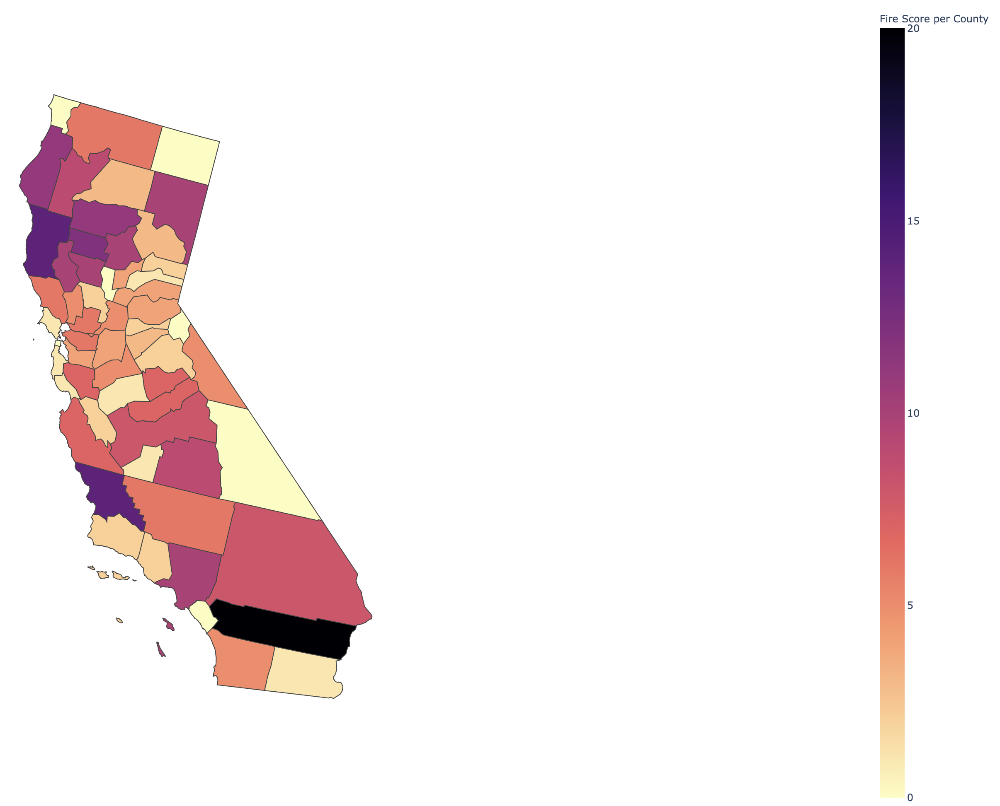
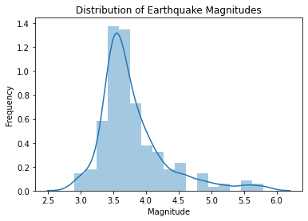
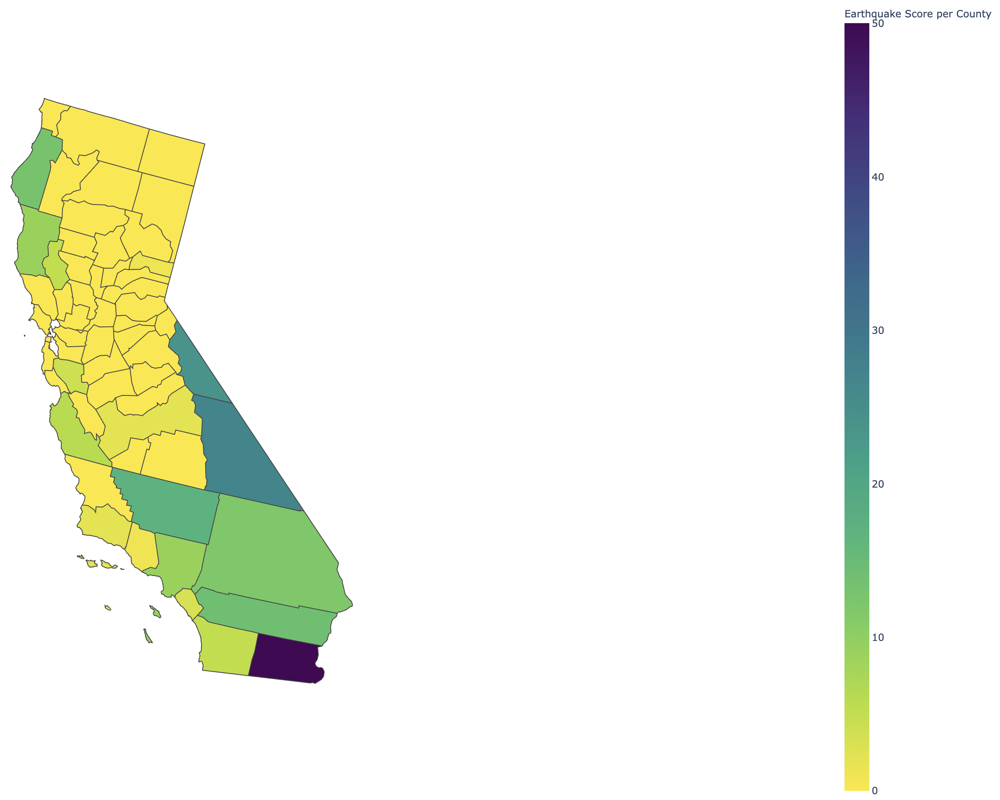
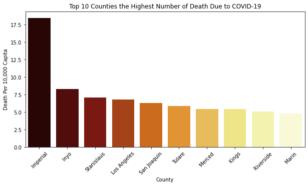
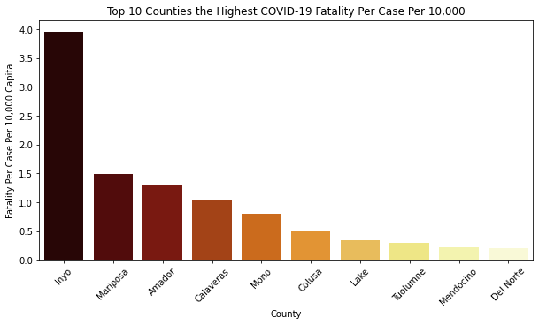
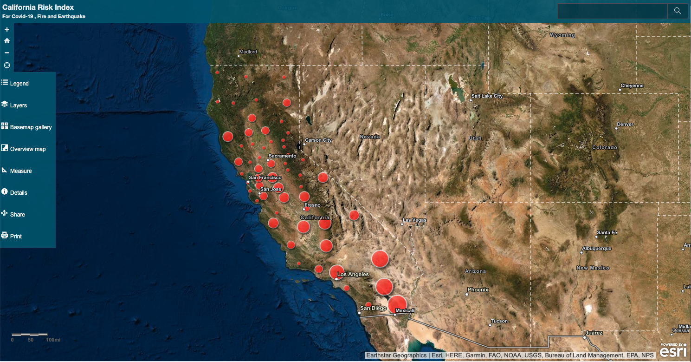

#  

# Project 5:  Risk Assesment Due to COVID-19, Wildfires, and Earthquakes in California
#### By: Emiko Sano, Minoo Taghavi, and Cameron Vann

---
## Executive Statement
---
Table of Content:
1. [Problem Statement](#problem)
2. [Description of Data](#data)
    * [Wildfires](#fire_data)
    * [Earthquakes](#earthquake_data)
    * [COVID-19](#covid_data)
    * [Data Dictionary](#dictionary)
3. [Disasters Analysis](#disasters)
    * [Wildfires](#fires)
    * [Earthquakes](#earthquakes)
    * [COVID-19](#covid)
    * [All three combined](#combined)
4. [Risk Map](#map)
5. [Conclusion](#conclusion)

### 1. Problem Statement:

The COVID-19 global pandemic has impacted all of our communities. In some areas, the impact of the pandemic has been exasperated by other natural disasters. In the state of California, wildfires have been devasating in recent years. Being part of the ring of fire and laying on top of large number of faults, earthquakes are also a constant threat.
There is a shortage of tools available for looking at the combined effect of the pandemic and other natural disasters. This makes it challenging for decision makers to assess risk and make appropriate prepardness plans. Here, we will provide a tool to visualize the concurrence of COVID-19 hot spots, wildfires, and earthquakes in California.

---

### 2. Description of Data:

We used various sources for collection of the data, and regardless of the source, the data reflect information for 2020 only.   

**COVID-19**:  
We relied on the aggregated data from [Jonh Hopkins Resourse Center](https://github.com/CSSEGISandData/COVID-19/tree/master/csse_covid_19_data) for COVID-19. Jonh Hopkins update their data daily. We collected [covid data](./data/california_covid.csv) on the most recent data as of October 17, 2020.  
[Wildfire data](./data/fire_data.csv) were collected from [Cal Fire](https://www.fire.ca.gov) on October 17, 2020. Some data were updated using [InciWeb](https://inciweb.nwcg.gov) and [San Francisco Chronicle Fire Tracker](https://www.sfchronicle.com/projects/california-fire-map/) during our exploratory analysis.    
Earthquake data were obtained from [Center for Engineering Strong Motion Data](https://strongmotioncenter.org/) for the lastest as of October 19, 2020.   
All three datasets were combined into a single dataset that represents all events per county-level. In order to summarize them to the county-level, fire data and earthquake data needed to be manipulated slightly differently (the covid dataset is already represented per county).  

**Wildfire**:  
First, we classified each fire based on the acres burned by the fire. The classifications and labels are as follows:   

| Acres Burned | Label|
| --- | --- |
| less than 200,000 | 1|
| 200,000 to 400,000 | 2|
| 400,000 to 600,000 | 3|
| 600,000 to 800,000 | 4|
| 800,000 to 1,000,000 | 5|
| above 1,000,000 | 6|

We then calculated the number of fires per county. For fires that affect multiple counties, the fire would counted in each county. Fire risk scores were then calculated taking into account the extent of each fire based on the acres burned and whether they are currently active. Each event was multiplied by the corresponding event label. This manipulation is intended to add a weight to the fire based on the extent of the fire. Fires were also classified based on whether they were active (label = `1`) or not (label = `0`). Again, each event was weighted based on this categories. The final score was calcaluted by adding the weighted values for all the events in each county.  

**Earthquake**:  
Similar to the wildfire riks scores, we first classified earthquakes based on the magnitude. We based our classifications on [Michigan Tech's USSeis](http://www.geo.mtu.edu/UPSeis/magnitude.html). These categories and their corresponding labels are as follows:

| Class | Label | Magnitude |
| --- | --- | --- |
| Great| 5 | 8 or more 7 - 7.9 |
| Strong| 4 | 6 - 6.9|
| Moderate| 3 | 5 - 5.9|
| Light| 2 | 4 - 4.9|
| Minor| 1 | 3 - 3.9|

The final earthquake risk scores were caluculated by the sum of all the weighted events (earthquake occurres).

These summarized values and scores were then appended to the COVID-19 dataset (that was already per county) to generate the dataset that we used for further analysis. The keys for this dataset are represented in the data dictionary below.

|Name|Data Type|Description|
|---|---|---|
|fibs|float|federal information processing standards code for county indentification|
|county|string|county name|
|province_state|string|state name|
|covid_last_update|string|data of last update for covid data in UTC|
|county_latitude|float|county latitude information|
|county_longitude|float|county longitude information|
|covid_confirmed|integer|number of confirmed COVID-19 cases (includes probable)|
|covid_death|integer|number of death due to COVID-19 (includes probable)|
|covid_recovered|integer|number of recovered COVID-19 cases (these are estimates and may be inaccurate)|
|covid_active|integer|number of active COVID-19 cases calculated from total cases - total recovered - total deaths|
|covid_incidence_rate|float|incidence rate of COVID-19 cases; cases per 100,000 persons.|
|covid_case_fatality_ratio|float|case-fatality ratio; number of deaths/number of cases|
|county_population|integer|population of the county|
|covid_death_per_capita|float|number of death per capita due to COVID-19 (deaths/county population)|
|covid_confirmed_per_capita|float|number of confirmed COVID-19 cases per capita (confirmed cases/county population)|
|covid_active_cases_per_capita|float|number of active COVID-19 cases per capita (active cases/county population)|
|fire_per_county_in_2020|integer|number of fires in 2020 per county (includes both inactive and active fires)|
|active_fires_per_county|integer|number of active fires per county|
|fire_score|integer|a score represeneting fire danger in each county: this is the sum of weighted events. The weight is determined based on the extent of fire and whether it is an active fire or not.|
|earthquakes_per_county_in_2020|integer|number of earthquakes in 2020 per county|
|earthquakes_score|integer|a score representing earthquake danger in each couny: this is the sum of weighted events. The weights are determined based on the magnitude of the earthquake.|

---

### 3. Disaster Analysis

**Wildires**   
The wildfires in california have been quite devasting in recent years, and 2020 has been another such catastrophic year. As of October 17, 2020, there have been 202 fires, and 19 of those are still active. The fires have also claimed the lifes of 31[[1]](https://www.fire.ca.gov/incidents/2020/). Three percent of all land in Californed has burned so far. This amounts to a total of 3,549,923 acres.
Not each county has been affected equally, and Riverside county in particular has been hit the hardest. There has been a total 18 wildfires, and one is still active. As seen in the below figure. As explained above, some recorded fires in the dataset have been 100% contained and some were still active. We used the number of fires, the extend of the areas that have burned and the status of fire whether it is active or contained to understand the fire dataset better. 

These risk indices can be easy visualized in the map below. 

**Earthquakes**  
California is part of the ring of fire, so earthquakes are frequent and have the potential for catastrophic results. 2020 has recorded 200 earthquakes with most of them being of relatively low magnitude which we can see in the distribution plot below. It is at a magnitude of approxiamtely 3.5 that we begin to feel the earth tremble.  As we increase from that level the chances for damage to be done increases. 

When scored the counties based on the indeces that we created, Imperial county has been affected the most this year.

Similarly, we observe these in a map at the county-level. 

**COVID-19**  
California is not alone in that the impact of COVID-19 is not uniform acorss locations. Different counties have more cases or deaths. At the county-level, Imperial county has the highest per capita cases and deaths.

Our map also demonstrates these differences at the county label. 

However, when we look at the counties that has the highest deaths per COVID-19 case per capita, Inyo county rises to the top. Inyo county is a relatively rural area. We suspect that absence of a large hospitals nearby and poverty are contributing to this high mortality rate.

This last result perhaps demonstrates the sad reality of how COVID-19 is affecting the poor and rural areas harder once it reaches those communities.

**Combined Risk** 

Through the use of Priniciple Componenet Analysis and KMeans clustering we were able to construct an algorithm and build a model that allowed us to
assign a risk index to the counties of California.  The higher the county scored on the index the more risky it was/is to be there.  That risk index was then used to 
construct a map that reflected the danger associated with all these disasters as it related to each county.

### 4. Risk Map
This [California Risk Index for Covid-19, Fire and Earthquake](https://www.arcgis.com/apps/View/index.html?appid=c4e18934a3eb490b8b270f2a51b13900) can be used by the user to identify the risk of their interst. This Web Mapping Application has been created through ArcGIS online platform and there are tools which gives you the oppurtinity to play around with different layers for the combined Risk Index, Covid-19 death, Fire Risk Score and Earthquake Risk Score per capita in 2020 and search for the region you are interested to know what natural disasters are close to it. Based on the legend for the combined Risk Index for these three natural disasters, the bigger the red circle on the map, the highest the risk index will be for that specific area. 

5. Conclusions
We made great maps (as in Minoo did) with a great model (Cameron).
**Both of you, do you want to take care this part?**
While our work does not show if the prevalence of natural disasters exacerbates the degreee to which a community is infected with Covid, we can almost
certainly assume that those communities that have high combined risks have had or will have their resources stretched.  Hopefully there's a chance that a model and
maps such as our can help people steer clear of these risky areas for their own safety as well as those in the community.  It may also serve as an indicator of
where resources and funds need to flow to provide relief.

